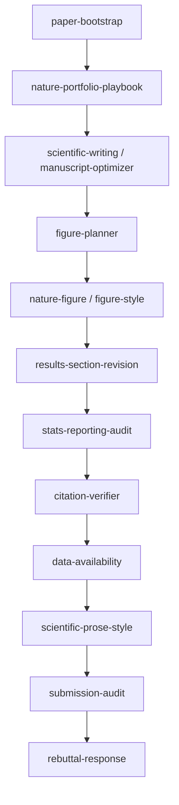

<div align="center">

# 🧬 Nature-Paper-Skills

**Agent skills for `Nature`-series journal manuscripts**

Drafting · structural revision · figure/text alignment · citation verification · pre-submission preflight · rebuttal
`journal-first` · `claim-driven` · evidence-bounded

<br/>

[](LICENSE)
[](docs/venue-routing.md)
[](docs/workflow-map.md)
[](docs/skill-map.md)
[](docs/installation-codex.md)
[](docs/installation-claude.md)
[](CONTRIBUTING.md)
[](https://github.com/Boom5426/Nature-Paper-Skills/stargazers)

[简体中文](README.md) · **English** · [Quick Start](#-quick-start) · [Skill Map](#-what-is-in-this-repo) · [Workflow](#-default-workflow)

</div>

---

> [!NOTE]
> This repository is opinionated. It is not a generic paper-writing toolbox. It is a journal-first skill stack for claim-driven manuscripts, figure-led storytelling, evidence-aware revision, and `Nature`-series pre-submission discipline.

## ✨ Highlights

- 🎯 **One claim per figure**: `figure-planner` decides what each figure argues, `nature-figure` renders it, `figure-style` checks correctness
- 🧱 **Structure before polish**: stabilize the evidence chain with a reverse outline first, then run sentence-level `scientific-prose-style`
- 🔬 **Evidence-bounded**: the abstract and introduction never promise more than the results show
- 📊 **Auditable stats and legends**: `stats-reporting-audit` guards independent-unit `n`, multiple comparisons, and figure-legend statistics
- 📎 **Citation hygiene**: `citation-verifier` does a local scan plus severity grading before you submit
- 📦 **Directly copyable**: every skill is self-contained, scripts ship inside their directory, and Codex and Claude Code coexist

## 📦 Quick Start

The fastest path is not to read every skill first. Install the recommended stack, then let the agent route your next step.

**Step 1: Clone the repository**

```bash
git clone https://github.com/Boom5426/Nature-Paper-Skills.git
cd Nature-Paper-Skills
```

**Step 2: Choose an install mode**

<details open>
<summary><b>Option A · Ask Codex to install it (recommended)</b></summary>

<br/>

Paste this into Codex:

```text
Install the recommended skills from this repository into ~/.codex/skills/: paper-workflow, paper-bootstrap, nature-portfolio-playbook, scientific-writing, manuscript-optimizer, results-section-revision, figure-planner, citation-verifier, data-availability, submission-audit, rebuttal-response, stats-reporting-audit, scientific-prose-style. Copy the full skill directories, not just SKILL.md. When finished, list the installed directories and use paper-workflow to tell me which skill I should use next for my manuscript.
```

</details>

<details>
<summary><b>Option B · Ask Claude Code to install it</b></summary>

<br/>

Paste this into Claude Code:

```text
Install the recommended skills from this repository into ~/.claude/skills/: paper-workflow, paper-bootstrap, nature-portfolio-playbook, scientific-writing, manuscript-optimizer, results-section-revision, figure-planner, citation-verifier, data-availability, submission-audit, rebuttal-response, stats-reporting-audit, scientific-prose-style. Copy the full skill directories, not just SKILL.md. When finished, list the installed directories and use paper-workflow to tell me which skill I should use next for my manuscript.
```

To affect only the current repository, change the target directory to `.claude/skills/`.

</details>

<details>
<summary><b>Option C · Install manually (shell)</b></summary>

<br/>

```bash
# Install target: Codex uses ~/.codex/skills; Claude Code uses ~/.claude/skills (or .claude/skills for this repo only)
DEST=~/.codex/skills          # Claude Code users: change to DEST=~/.claude/skills
mkdir -p "$DEST"
cp -R \
  skills/core/paper-workflow \
  skills/core/paper-bootstrap \
  skills/core/scientific-writing \
  skills/core/manuscript-optimizer \
  skills/core/results-section-revision \
  skills/core/figure-planner \
  skills/core/citation-verifier \
  skills/core/data-availability \
  skills/core/submission-audit \
  skills/core/rebuttal-response \
  skills/core/stats-reporting-audit \
  skills/core/scientific-prose-style \
  skills/venue/nature-portfolio-playbook \
  "$DEST"/
```

</details>

> [!TIP]
> The **figure skills** (`nature-figure`, `figure-style`) are not in the recommended install set by default because they need a plotting backend (Python matplotlib/seaborn or R ggplot2). `nature-figure`'s optional AI-schematic route additionally needs an `OPENROUTER_API_KEY`. See the Figure Stack section in [docs/installation-claude.md](docs/installation-claude.md) or [docs/installation-codex.md](docs/installation-codex.md).
>
> To enable the `nature-figure` / `figure-style` trio shown in the highlights and workflow, run one more copy after the recommended set: `cp -R skills/figure/nature-figure skills/figure/figure-style "$DEST"/`.

**First prompt after install**

```text
Use paper-workflow to tell me which skill I should use next for this manuscript.
```

## 🔄 Default Workflow



> `nature-figure` / `figure-style` in the diagram are the optional Figure Stack; install them per the TIP above.

The default assumption is:

- journal-first, not conference-first
- `Nature`-series journals by default unless the user or project says otherwise
- structure and evidence chain before sentence polish

## 🧩 What Is In This Repo

**Core** `skills/core/`

| Skill | What it does |
|---|---|
| `paper-workflow` | Top-level router: pick the right skill in the right order |
| `paper-bootstrap` | Initialize a paper project, source of truth, and state files |
| `scientific-writing` | Draft or rewrite manuscript sections in full prose |
| `manuscript-optimizer` | Repair claim structure, evidence chain, terminology, figure logic |
| `results-section-revision` | Repair late-stage narrative flow inside Results subsections |
| `figure-planner` | One claim per figure, panel roles, legend sync, Nature palette |
| `citation-verifier` | Bibliography and BibTeX hygiene with severity grading |
| `data-availability` | Data Availability statements, repositories/accession, FAIR, zh alignment |
| `submission-audit` | Final manuscript preflight before submission or resubmission |
| `rebuttal-response` | Turn reviewer comments into aligned edits and response letters |
| `stats-reporting-audit` | Statistical-reporting audit (n, replication, multiplicity, legend stats) |
| `scientific-prose-style` | Sentence-level linting (em-dash budget, hedging, rhythm) |

**Figure** `skills/figure/`

| Skill | What it does |
|---|---|
| `nature-figure` | Submission-grade Python/R figure workflow plus optional OpenRouter AI schematics (needs a plotting backend) |
| `figure-style` | Publication-grade figure correctness and legibility checklist with portable matplotlib helpers |

**Venue** `skills/venue/`

| Skill | What it does |
|---|---|
| `nature-portfolio-playbook` | Position among Nature / Nature Methods / Nature Biotechnology and run a policy preflight |

**Research and Review** `skills/research/` · `skills/review/`

| Skill | What it does |
|---|---|
| `paper-analyzer` | Structured deep read of a single paper |
| `academic-researcher` | Literature review and methodology support |
| `results-analysis` | Turn experiment outputs into defensible paper-ready findings |
| `paper-reviewer` | Reviewer-side evaluation of methodology, statistics, reproducibility |

**Optional** `skills/optional/`

| Skill | What it does |
|---|---|
| `reference-audit-guide` | Citation-verification principles |
| `conference-paper-writing` | Conference-first workflows only |
| `academic-presentations` | Turn papers into decks or talks |

## 🧭 Design Principles

- claim-driven, not panel-driven
- one main claim per figure unless a stronger split is clearly necessary
- figure legends are the second layer of result narration
- keep only the numbers needed to support the local claim in the main text
- reverse-outline before polishing stale prose
- never let the front half promise more than the downstream evidence supports
- decide venue fit and article type before optimizing around the wrong target

See [workflow-map](docs/workflow-map.md) · [skill-map](docs/skill-map.md) · [venue-routing](docs/venue-routing.md) · [design-principles](docs/design-principles.md).

## 📐 Repository Layout

```text
Nature-Paper-Skills/
├── docs/            # workflow maps, installation notes, design references
├── examples/        # expected output and handoff samples
├── skills/
│   ├── core/        # default journal workflow
│   ├── figure/      # figure production and figure correctness
│   ├── venue/       # venue selection and policy
│   ├── research/    # literature, analysis, evidence generation
│   ├── review/      # reviewer-side evaluation
│   └── optional/    # useful but non-default extensions
├── ATTRIBUTION.md
├── CONTRIBUTING.md
├── README.md
└── README.en.md
```

Scripts needed by a skill live inside that skill directory, so each skill stays installable as a self-contained unit.

## 🎯 Scope

| For | Not trying to be |
|---|---|
| `Nature`-series life-science / computational-biology / methods papers | a universal academic-writing library |
| methods, frameworks, benchmarks, resources, translational analysis | a conference-template collection |
| drafting, revision, submission preflight, and rebuttal | a full research orchestration platform |
|  | a replacement for journal author guidelines |

## 🤝 Contributing

See [CONTRIBUTING.md](CONTRIBUTING.md) for contribution rules, naming conventions, and pull-request expectations. Source attribution is in [ATTRIBUTION.md](ATTRIBUTION.md).

## 🙏 Acknowledgements

Parts of this repository were inspired by [OpenLAIR/dr-claw](https://github.com/OpenLAIR/dr-claw), [Yuan1z0825/nature-skills](https://github.com/Yuan1z0825/nature-skills), and the Claude Science skill pack. Thanks to everyone in the community who contributed code, docs, and tests. Per-component provenance and licensing are in [ATTRIBUTION.md](ATTRIBUTION.md).

## 📄 License

Repository-original content is [MIT](LICENSE). Some vendored skills (`nature-figure`, `figure-style`, `scientific-prose-style`, `stats-reporting-audit`, and several merged fragments) are Apache-2.0: full text in [LICENSE-APACHE](LICENSE-APACHE), coverage in [NOTICE](NOTICE).
