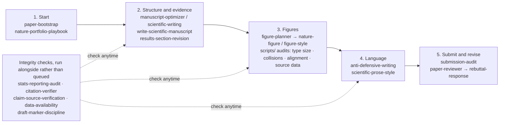

<div align="center">

# 🧬 Nature-Paper-Skills

**Agent skills for `Nature`-series journal manuscripts**

Drafting · structural revision · figure/text alignment · citation verification · pre-submission preflight · rebuttal
`journal-first` · `claim-driven` · evidence-bounded

<br/>

[](LICENSE)
[](docs/venue-routing.md)
[](docs/workflow-map.md)
[](docs/skill-map.md)
[](docs/installation-codex.md)
[](docs/installation-claude.md)
[](CONTRIBUTING.md)
[](https://github.com/Boom5426/Nature-Paper-Skills/stargazers)

[简体中文](README.md) · **English** · [Quick Start](#-quick-start) · [Skill Map](#-what-is-in-this-repo) · [Workflow](#-default-workflow)

</div>

---

> [!NOTE]
> This repository is opinionated. It is not a generic paper-writing toolbox. It is a journal-first skill stack for claim-driven manuscripts, figure-led storytelling, evidence-aware revision, and `Nature`-series pre-submission discipline.

## ✨ Highlights

- 🎯 **One claim per figure**: `figure-planner` decides what each figure argues, `nature-figure` renders it, `figure-style` checks correctness
- 🧱 **Structure before polish**: stabilize the evidence chain with a reverse outline first, then run sentence-level `scientific-prose-style`
- 🔬 **Evidence-bounded**: the abstract and introduction never promise more than the results show
- 📊 **Auditable stats and legends**: `stats-reporting-audit` guards independent-unit `n`, multiple comparisons, and figure-legend statistics
- 📎 **Citation hygiene**: `citation-verifier` does a local scan plus severity grading before you submit
- 🔧 **Figure audits that actually run**: `qa-contract.md`'s prose rules have matching commands, so type size, collisions, panel alignment, and source-data traceability are checked rather than asserted, and a tool that cannot check says so instead of passing
- 🚪 **Many entry points**: `paper-workflow` is the fallback, not the only door; call any layer directly
- 📦 **Directly copyable**: every skill is self-contained, scripts ship inside their directory, and Codex and Claude Code coexist

## 📦 Quick Start

One command. No clone required. It detects whether you use Codex or Claude Code, installs the recommended 18-skill stack, and cleanly replaces any earlier copy.

```bash
curl -fsSL https://raw.githubusercontent.com/Boom5426/Nature-Paper-Skills/main/install.sh | bash
```

Then fully restart your agent so it picks up the new skills (quit and relaunch Claude Code or Codex, not just `/clear`), and paste:

```text
Use paper-workflow to tell me which skill I should use next for this manuscript.
```

After that, phrase requests however you like. A general ask such as `improve my paper`,
`polish this`, or `get this ready to submit` enters through paper-workflow, which classifies
the request and announces the full chain instead of reaching for a single skill.

```text
Improve this manuscript.
```

That is the whole setup. Everything below is optional.

<details>
<summary><b>Install options</b></summary>

<br/>

```bash
# Choose the agent yourself instead of auto-detecting (claude | codex | both)
curl -fsSL https://raw.githubusercontent.com/Boom5426/Nature-Paper-Skills/main/install.sh | bash -s -- --agent codex

# Add the figure stack (needs a plotting backend; see the TIP below)
curl -fsSL https://raw.githubusercontent.com/Boom5426/Nature-Paper-Skills/main/install.sh | bash -s -- --figure

# Install into the current project only, not your home directory (Claude Code)
curl -fsSL https://raw.githubusercontent.com/Boom5426/Nature-Paper-Skills/main/install.sh | bash -s -- --agent claude --local

# All 27 skills, or preview without writing anything
curl -fsSL https://raw.githubusercontent.com/Boom5426/Nature-Paper-Skills/main/install.sh | bash -s -- --set all
curl -fsSL https://raw.githubusercontent.com/Boom5426/Nature-Paper-Skills/main/install.sh | bash -s -- --dry-run
```

Run the installer with `--help` for the full flag list. Re-running it upgrades in place.

</details>

<details>
<summary><b>Prefer to read the script before running it, or work from a clone</b></summary>

<br/>

Piping a script from the internet into `bash` is a reasonable thing to be wary of. Read [install.sh](install.sh) first, or clone and run it locally:

```bash
git clone https://github.com/Boom5426/Nature-Paper-Skills.git
cd Nature-Paper-Skills
./install.sh --agent claude --figure
```

Run this way, the installer copies from your clone and downloads nothing. Pass `--ref <branch|tag|sha>` if you want it to fetch a specific published version instead.

</details>

<details>
<summary><b>Prefer to install by hand</b></summary>

<br/>

Copy whole skill directories, not just `SKILL.md`, because some skills carry local scripts. Delete an existing copy before re-copying, otherwise files removed upstream linger and you end up with two versions mixed in one directory.

```bash
# Codex uses ~/.codex/skills; Claude Code uses ~/.claude/skills (or .claude/skills for one repo only)
DEST=~/.codex/skills
mkdir -p "$DEST"
for s in skills/core/*/ skills/venue/nature-portfolio-playbook/; do
  name=$(basename "$s")
  rm -rf "$DEST/$name"
  cp -R "$s" "$DEST/$name"
done
```

Per-agent details: [docs/installation-claude.md](docs/installation-claude.md) · [docs/installation-codex.md](docs/installation-codex.md).

</details>

> [!TIP]
> The **figure skills** (`nature-figure`, `figure-style`) are not in the recommended set by default because they need a plotting backend (Python matplotlib/seaborn or R ggplot2). `nature-figure`'s optional AI-schematic route additionally needs an `OPENROUTER_API_KEY`; the Python/R plotting core works without it. Add them with `--figure`.

## 🔄 Default Workflow


```mermaid
flowchart LR
    A["1. Start<br/>paper-bootstrap<br/>nature-portfolio-playbook"]
    B["2. Structure and evidence<br/>manuscript-optimizer / scientific-writing<br/>write-scientific-manuscript<br/>results-section-revision"]
    C["3. Figures<br/>figure-planner → nature-figure / figure-style<br/>scripts/ audits: type size · collisions · alignment · source data"]
    D["4. Language<br/>anti-defensive-writing<br/>scientific-prose-style"]
    E["5. Submit and revise<br/>submission-audit<br/>paper-reviewer → rebuttal-response"]
    F["Integrity checks, run alongside rather than queued<br/>stats-reporting-audit · citation-verifier<br/>claim-source-verification · data-availability<br/>draft-marker-discipline"]
    A --> B --> C --> D --> E
    F -.check anytime.-> B
    F -.check anytime.-> C
    F -.check anytime.-> D
```

Three constraints carry the information here. **Structure precedes language**: stage 2 before stage 4, because editing the wrong layer wastes the edit. **Integrity checks run alongside**, not as one stop on a line; whatever they find sends you back to stage 2 or 3. **Stage 4 is itself ordered**: `anti-defensive-writing` before `scientific-prose-style`, because removing defensive scaffolding rewrites paragraph openers and sentence boundaries, so the reverse order does that work twice.

> `nature-figure` / `figure-style` in the diagram are the optional Figure Stack; install them per the TIP above.
>
> A **Review, survey, or Perspective** does not follow this chain. Start with `review-article-architecture` to establish the governing plan, set up markers with `draft-marker-discipline`, and run a drift audit before any compression pass. Full path in [docs/workflow-map.md](docs/workflow-map.md).

The default assumption is:

- journal-first, not conference-first
- `Nature`-series journals by default unless the user or project says otherwise
- structure and evidence chain before sentence polish

## 🚪 Entry points: not just `paper-workflow`

`paper-workflow` is the **fallback** door, for when you are not sure which skill the job needs. Its job is to classify the request and name the chain, not to absorb every request. Any layer can be called directly.

| What you want | Just say | Where it goes |
|---|---|---|
| Not sure what is next | "improve my paper", "pre-submission check" | `paper-workflow` classifies, then names the chain |
| Start a new manuscript | "set up a new paper directory" | `paper-bootstrap` |
| Pick a journal and article type | "Nature Methods or Nature Biotech?" | `nature-portfolio-playbook` |
| Structure and evidence chain unstable | "this draft does not hold together" | `manuscript-optimizer` |
| Correct but hard to follow | "this paragraph is awkward" | `write-scientific-manuscript` |
| Decide what each figure proves | "how should these figures be arranged" | `figure-planner` |
| Draw the figure | "make a comparison figure" | `nature-figure` |
| Check a finished figure | "is anything wrong with this figure" | `figure-style` |
| Results reads figure-by-figure | "Results is a list of numbers" | `results-section-revision` |
| Statistical reporting | "check the statistics", "what counts as n" | `stats-reporting-audit` |
| Bibliography hygiene | "check the references" | `citation-verifier` |
| Does the source support the claim | "is this citation right for this sentence" | `claim-source-verification` |
| Data availability statement | "write the data availability section" | `data-availability` |
| Reads timid or over-caveated | "too many disclaimers", "make it more direct" | `anti-defensive-writing` |
| Sentence-level polish | "polish this paragraph" | `scientific-prose-style` |
| Pre-submission preflight | "full check before I submit" | `submission-audit` |
| Reviewer response | "reply to the referees" | `rebuttal-response` |
| Review or Perspective | "write a review article" | `review-article-architecture` (a separate path) |

> One exception: a **general** manuscript request should enter through `paper-workflow`. A paper has four layers (structure, passage logic, venue style, punctuation), editing the wrong layer first wastes the edit, and one skill covers one layer. Name a skill or a specific job and go straight there.

## 🔬 The figure chain, expanded

Figures are the one layer with executable audits, so it is worth spelling out:

```
figure-planner          one claim per figure, panel roles, main vs supplement,
   │                    legend and Results aligned. Draws nothing.
   ▼
nature-figure           routing protocol
   ├ step 1  read the manifest plus the always-loaded contract.md / stance.md
   ├ step 2  backend gate (blocking): Python or R, remembered
   ├ step 3  load only the selected backend's fragment
   ├ step 4  build: five-point contract -> stance -> backend fragment
   ├ step 5  open any of the 17 references on demand
   └ step 6  run the audits before delivery
   ▼
figure-style            correctness checklist plus the kernel.py helpers
   ▼
audit scripts           before rendering  validate_figure.py my_figure.py
(skills/figure/         after export      audit_pdf_text.py panel_a.pdf --min-pt 5   <- per panel
 nature-figure/         after assembly    audit_figure_collisions.py fig02.pdf       <- the composite
 scripts/)              multi-panel       audit_panel_alignment.py fig02.layout.json
                        data side         figure_source_data.py -> <figure>.qa.json
                        numerics          figure_safety.py
   ▼
qa-contract.md          pre-submission checklist
```

**One exit-code contract**, shared by the four audit tools. `validate_figure.py` only ever returns 0/1/2, because a static source check always runs and can always answer; the other three also use 3 and 4:

| Code | Meaning | A pass? |
|---|---|---|
| 0 | PASS, the check ran and the figure is acceptable | yes |
| 1 | FAIL, the check ran and found a blocking problem | no |
| 2 | ERROR, usage or I/O problem; nothing was audited | no |
| 3 | NOT RUN, a required dependency is absent | no |
| 4 | NOT AUDITABLE, the input cannot answer this question | no |

Codes 2, 3, and 4 mean the figure is **unchecked**, not clean. A wrapper that branches on `returncode != 1` ships an unaudited figure, and an audit that cannot say "I could not check this" is more dangerous than no audit at all.

## 🧩 What Is In This Repo

**Core** `skills/core/`

| Skill | What it does |
|---|---|
| `paper-workflow` | The entry point for any general request: classifies by input granularity and prescribes the full chain to run |
| `paper-bootstrap` | Initialize a paper project, source of truth, and state files |
| `write-scientific-manuscript` | Passage-level clarity and logic diagnosis: why a paragraph is hard to follow, and what to change |
| `scientific-writing` | Draft or rewrite manuscript sections in full prose |
| `manuscript-optimizer` | Repair claim structure, evidence chain, terminology, figure logic |
| `results-section-revision` | Repair late-stage narrative flow inside Results subsections |
| `figure-planner` | One claim per figure, panel roles, legend sync, Nature palette |
| `citation-verifier` | Bibliography and BibTeX hygiene with severity grading, plus LaTeX toolchain hardening |
| `claim-source-verification` | Adversarial checking of whether a cited source supports the sentence citing it |
| `review-article-architecture` | Review / survey / Perspective structure: governing plan, drift audit, thesis-as-macro |
| `draft-marker-discipline` | In-source draft markers, triage by resolution route, honest word counts, safe archival |
| `data-availability` | Data Availability statements, repositories/accession, FAIR, zh alignment |
| `submission-audit` | Final manuscript preflight before submission or resubmission |
| `rebuttal-response` | Turn reviewer comments into aligned edits and response letters |
| `stats-reporting-audit` | Statistical-reporting audit (n, replication, multiplicity, legend stats) |
| `anti-defensive-writing` | Rhetorical posture: unnecessary disclaimers, caveats in high-impact positions, paragraphs that open with a limitation. A limitation placed by an integrity check is load-bearing and is reshaped, never deleted |
| `scientific-prose-style` | Sentence-level linting (em-dash budget, hedging, rhythm) |

**Figure** `skills/figure/`

| Skill | What it does |
|---|---|
| `nature-figure` | Submission-grade Python/R figure workflow plus optional OpenRouter AI schematics (needs a plotting backend) |
| `figure-style` | Publication-grade figure correctness and legibility checklist with portable matplotlib helpers |

**Venue** `skills/venue/`

| Skill | What it does |
|---|---|
| `nature-portfolio-playbook` | Position among Nature / Nature Methods / Nature Biotechnology and run a policy preflight |

**Research and Review** `skills/research/` · `skills/review/`

| Skill | What it does |
|---|---|
| `paper-analyzer` | Structured deep read of a single paper |
| `academic-researcher` | Literature review and methodology support |
| `results-analysis` | Turn experiment outputs into defensible paper-ready findings |
| `paper-reviewer` | Reviewer-side evaluation of methodology, statistics, reproducibility; splits a received report into atomic asks and grades a reply for one-to-one coverage |

**Optional** `skills/optional/`

| Skill | What it does |
|---|---|
| `reference-audit-guide` | Verify references exist against CrossRef / Semantic Scholar / arXiv / PubMed; ships runnable checkers |
| `conference-paper-writing` | Conference-first workflows only |
| `academic-presentations` | Turn papers into decks or talks |

<details>
<summary><b>Troubleshooting</b></summary>

<br/>

**The agent does not seem to see the skills.** A full restart is required after installing. Quit the process and relaunch it; `/clear` is not enough, because it does not rescan the skills directory.

**It used one skill instead of running the chain.** Say `use paper-workflow` explicitly, or phrase the request more generally (`improve this manuscript`). `paper-workflow` classifies the request and announces the chain before starting; if no chain was announced, a different skill matched, so name paper-workflow directly.

**It told me to use a skill I do not have.** The default install is 18 skills. `nature-figure` and `figure-style` need `--figure` (and a plotting backend: matplotlib/seaborn or ggplot2); everything else comes with `--set all`.

**Where things were installed.** `~/.claude/skills/` for Claude Code, `~/.codex/skills/` for Codex, and `./.claude/skills/` with `--local`. Use `bash install.sh --list` to preview the set and `--dry-run` to see what would happen without writing anything.

**Both Codex and Claude Code.** Use `--agent both`; the two installs do not interfere.

**Pinning or rolling back.** `--ref <branch|tag|sha>` installs from a specific ref. Re-running is idempotent and cleanly replaces the previous copy.

</details>

## 🧭 Design Principles

- claim-driven, not panel-driven
- one main claim per figure unless a stronger split is clearly necessary
- figure legends are the second layer of result narration
- keep only the numbers needed to support the local claim in the main text
- reverse-outline before polishing stale prose
- never let the front half promise more than the downstream evidence supports
- decide venue fit and article type before optimizing around the wrong target
- a source must support the claim, not merely exist and carry correct metadata
- governing document over good ideas: raise the conflict, do not resolve it by editing

See [workflow-map](docs/workflow-map.md) · [skill-map](docs/skill-map.md) · [venue-routing](docs/venue-routing.md) · [design-principles](docs/design-principles.md).

## 📐 Repository Layout

```text
Nature-Paper-Skills/
├── docs/            # workflow maps, installation notes, design references
├── examples/        # expected output and handoff samples
├── skills/
│   ├── core/        # default journal workflow
│   ├── figure/      # figure production and figure correctness
│   ├── venue/       # venue selection and policy
│   ├── research/    # literature, analysis, evidence generation
│   ├── review/      # reviewer-side evaluation
│   └── optional/    # useful but non-default extensions
│                    #   figure/nature-figure/scripts/ holds 6 dependency-free audit tools
├── tests/           # 243 tests, `python3 -m unittest discover -s tests`
├── install.sh       # one-line installer for Codex and Claude Code
├── ATTRIBUTION.md   # per-component provenance, incl. the Apache-2.0 4(b) modified-file list (test-guarded)
├── CONTRIBUTING.md
├── LICENSE          # MIT, for repository-original content
├── LICENSE-APACHE   # full Apache-2.0 text for the vendored skills
├── NOTICE
├── README.md
└── README.en.md
```

Scripts needed by a skill live inside that skill directory, so each skill stays installable as a self-contained unit. `install.sh` also copies `LICENSE-APACHE` and `NOTICE` into each of the 8 skill directories that carry Apache-2.0 material, so a `curl | bash` install arrives with its licence.

## 🎯 Scope

| For | Not trying to be |
|---|---|
| `Nature`-series life-science / computational-biology / methods papers | a universal academic-writing library |
| methods, frameworks, benchmarks, resources, translational analysis | a conference-template collection |
| drafting, revision, submission preflight, and rebuttal | a full research orchestration platform |
|  | a replacement for journal author guidelines |

## 🤝 Contributing

See [CONTRIBUTING.md](CONTRIBUTING.md) for contribution rules, naming conventions, and pull-request expectations. Source attribution is in [ATTRIBUTION.md](ATTRIBUTION.md).

## 🙏 Acknowledgements

Parts of this repository were inspired by [OpenLAIR/dr-claw](https://github.com/OpenLAIR/dr-claw), [Yuan1z0825/nature-skills](https://github.com/Yuan1z0825/nature-skills), and the Claude Science skill pack.

The figure layer's encoding rules draw on design observations from [ChenLiu-1996/figures4papers](https://github.com/ChenLiu-1996/figures4papers) (Chen Liu, Yale), a collection of production plotting scripts behind published figures. That repository publishes no LICENSE, so this one copies and distributes none of its code or prose; every recipe was written independently. Full statement in [THIRD_PARTY_NOTICES.md](skills/figure/nature-figure/THIRD_PARTY_NOTICES.md).

Thanks to everyone in the community who contributed code, docs, and tests. Per-component provenance and licensing are in [ATTRIBUTION.md](ATTRIBUTION.md).

## 📄 License

Repository-original content is [MIT](LICENSE). Some vendored skills (`nature-figure`, `figure-style`, `scientific-prose-style`, `stats-reporting-audit`, and several merged fragments) are Apache-2.0: full text in [LICENSE-APACHE](LICENSE-APACHE), coverage in [NOTICE](NOTICE).
