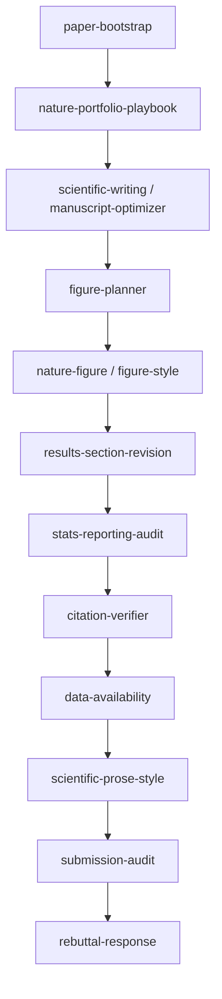

<div align="center">

# 🧬 Nature-Paper-Skills

**面向 `Nature` 系列期刊稿件的 agent skill 仓库**

从初稿搭建 · 结构修订 · 图文对齐 · 引用核验 · 投稿前预检 到 返修回复的全链路
`journal-first` · `claim-driven` · 证据边界优先

<br/>

[](LICENSE)
[](docs/venue-routing.md)
[](docs/workflow-map.md)
[](docs/skill-map.md)
[](docs/installation-codex.md)
[](docs/installation-claude.md)
[](CONTRIBUTING.md)
[](https://github.com/Boom5426/Nature-Paper-Skills/stargazers)

**简体中文** · [English](README.en.md) · [快速开始](#-快速开始) · [技能地图](#-仓库里有什么) · [默认工作流](#-默认工作流)

</div>

---

> [!NOTE]
> 这是一个**强约束**的仓库，不是"通用论文写作技巧集合"。默认立场是 journal-first、claim-driven、证据边界优先；未明确 venue 时按 `Nature` 系列期刊导向处理。

## ✨ 特性

- 🎯 **一图一主张**：`figure-planner` 先定每张图的论点，`nature-figure` 出图，`figure-style` 查正确性
- 🧱 **结构先于润色**：先用 reverse outline 稳住证据链，再做句子级 `scientific-prose-style`
- 🔬 **证据边界优先**：Abstract / Introduction 不允许比下游证据更强
- 📊 **统计与图注可审计**：`stats-reporting-audit` 守住独立实验单元 n、多重比较、图注统计
- 📎 **引用卫生**：`citation-verifier` 本地扫描 + 严重度分级，先查后投
- 📦 **可直接复制**：每个 skill 自包含，脚本随目录分发，Codex 与 Claude Code 可并存

## 📦 快速开始

一条命令，不用克隆。脚本会自动识别你用的是 Codex 还是 Claude Code，装好推荐的 13 个 skill，并干净地覆盖旧版本。

```bash
curl -fsSL https://raw.githubusercontent.com/Boom5426/Nature-Paper-Skills/main/install.sh | bash
```

装完后彻底重启 agent 让它加载新装的 skills（退出并重新打开 Claude Code 或 Codex，不是 /clear），再把这句话发过去：

```text
用 paper-workflow 帮我判断这篇稿子下一步该用哪个 skill。
```

到这里就装完了，下面全是可选项。

<details>
<summary><b>安装选项</b></summary>

<br/>

```bash
# 不用自动识别，自己指定 agent（claude | codex | both）
curl -fsSL https://raw.githubusercontent.com/Boom5426/Nature-Paper-Skills/main/install.sh | bash -s -- --agent codex

# 额外装上图形技能（需要绘图后端，见下方 TIP）
curl -fsSL https://raw.githubusercontent.com/Boom5426/Nature-Paper-Skills/main/install.sh | bash -s -- --figure

# 只对当前项目生效，不写入 home 目录（Claude Code）
curl -fsSL https://raw.githubusercontent.com/Boom5426/Nature-Paper-Skills/main/install.sh | bash -s -- --agent claude --local

# 装全部 22 个 skill；或先预览，不写任何文件
curl -fsSL https://raw.githubusercontent.com/Boom5426/Nature-Paper-Skills/main/install.sh | bash -s -- --set all
curl -fsSL https://raw.githubusercontent.com/Boom5426/Nature-Paper-Skills/main/install.sh | bash -s -- --dry-run
```

完整参数见 `--help`。重复执行即原地升级。

</details>

<details>
<summary><b>想先看脚本内容，或者习惯从克隆装</b></summary>

<br/>

把网上的脚本直接 pipe 给 `bash` 值得警惕，这很合理。可以先读 [install.sh](install.sh)，或者克隆下来本地跑：

```bash
git clone https://github.com/Boom5426/Nature-Paper-Skills.git
cd Nature-Paper-Skills
./install.sh --agent claude --figure
```

这样运行时脚本直接用你本地的克隆作为来源，不会联网下载任何东西。如果想改成拉取某个已发布版本，加 `--ref <branch|tag|sha>`。

</details>

<details>
<summary><b>想完全手动装</b></summary>

<br/>

复制整个 skill 目录，不要只复制 `SKILL.md`，因为部分 skill 自带脚本。重装前先删掉旧目录，否则上游已删除的文件会残留，同一个目录里混着两个版本。

```bash
# 安装目标：Codex 用 ~/.codex/skills；Claude Code 用 ~/.claude/skills（仅当前仓库用 .claude/skills）
DEST=~/.codex/skills
mkdir -p "$DEST"
for s in skills/core/*/ skills/venue/nature-portfolio-playbook/; do
  name=$(basename "$s")
  rm -rf "$DEST/$name"
  cp -R "$s" "$DEST/$name"
done
```

分 agent 的细节见 [docs/installation-claude.md](docs/installation-claude.md) · [docs/installation-codex.md](docs/installation-codex.md)。

</details>

> [!TIP]
> **图形技能**（`nature-figure`、`figure-style`）默认不在推荐安装集内，因为它们需要绘图后端（Python matplotlib / seaborn 或 R ggplot2）。`nature-figure` 的可选 AI 示意图路线另需 `OPENROUTER_API_KEY`，Python / R 绘图主路线不需要。加 `--figure` 即可安装。

## 🔄 默认工作流



> 工作流图中的 `nature-figure` / `figure-style` 属可选 Figure Stack，需按上方 TIP 额外安装。

默认假设：

- 以期刊稿为主，不以会议稿为主
- 未明确 venue 时按 `Nature` 系列期刊导向处理
- 先修结构与证据链，再做语句级润色

## 🧩 仓库里有什么

**核心技能** `skills/core/`

| Skill | 作用 |
|---|---|
| `paper-workflow` | 顶层路由：选对 skill、按对顺序推进 |
| `paper-bootstrap` | 初始化论文项目、source of truth 与状态文件 |
| `scientific-writing` | 章节撰写与重写（全段落 prose）|
| `manuscript-optimizer` | 结构、证据链、术语、图逻辑漂移修复 |
| `results-section-revision` | Results 小节级叙述结构修复 |
| `figure-planner` | 一图一主张、panel 角色、legend 同步、Nature 配色 |
| `citation-verifier` | 引用与 BibTeX 卫生 + 严重度分级 |
| `data-availability` | 数据可用性声明、仓库/accession、FAIR、中文对照 |
| `submission-audit` | 投稿前 / 返修前总预检 |
| `rebuttal-response` | 审稿意见回复与改稿联动 |
| `stats-reporting-audit` | 统计报告审计（n、重复性、多重比较、图注统计）|
| `scientific-prose-style` | 句子级润色（em-dash 预算、hedging、句长节奏）|

**图形技能** `skills/figure/`

| Skill | 作用 |
|---|---|
| `nature-figure` | 提交级 Python / R 出图工作流 + 可选 OpenRouter AI 示意图（需绘图后端）|
| `figure-style` | 出版级图形正确性与可读性清单 + 可移植 matplotlib 辅助函数 |

**期刊定位技能** `skills/venue/`

| Skill | 作用 |
|---|---|
| `nature-portfolio-playbook` | 在 Nature / Nature Methods / Nature Biotechnology 间定位并做政策预检 |

**研究与审稿技能** `skills/research/` · `skills/review/`

| Skill | 作用 |
|---|---|
| `paper-analyzer` | 单篇论文的结构化深读 |
| `academic-researcher` | 文献综述与方法学支持 |
| `results-analysis` | 把实验输出转成可辩护的论文级结论 |
| `paper-reviewer` | 审稿人视角的方法 / 统计 / 复现性评估 |

**可选技能** `skills/optional/`

| Skill | 作用 |
|---|---|
| `reference-audit-guide` | 引用核验原则 |
| `conference-paper-writing` | 仅用于 conference-first 流程 |
| `academic-presentations` | 论文转 slides / talk |

## 🧭 设计原则

- claim-driven，而不是 panel-driven
- 一张主图尽量只承载一个主结论
- 图注是结果叙述的第二层，不是只解释坐标轴
- 主文只保留支撑本段 claim 的关键数字
- 对已有章节重写前，先做 reverse outline
- 不允许前半部分（Abstract / Introduction）比下游证据更强
- venue 与 article type 要前置决策，不要末期再救火

详见 [workflow-map](docs/workflow-map.md) · [skill-map](docs/skill-map.md) · [venue-routing](docs/venue-routing.md) · [design-principles](docs/design-principles.md)。

## 📐 仓库结构

```text
Nature-Paper-Skills/
├── docs/            # 工作流图、安装说明、设计参考
├── examples/        # 期望输出与 handoff 样例
├── skills/
│   ├── core/        # 默认期刊工作流
│   ├── figure/      # 图形生产与图形正确性
│   ├── venue/       # 期刊定位与政策
│   ├── research/    # 文献、分析、证据生成
│   ├── review/      # 审稿人视角评估
│   └── optional/    # 有用但非默认的扩展
├── install.sh       # Codex / Claude Code 一条命令安装脚本
├── ATTRIBUTION.md
├── CONTRIBUTING.md
├── README.md
└── README.en.md
```

脚本随 skill 目录分发，保证 skill 可独立复制和复用。

## 🎯 适用范围

| 适用 | 不追求 |
|---|---|
| `Nature` 系列生命科学 / 计算生物 / 方法学论文 | 覆盖所有期刊写作风格 |
| methods / frameworks / benchmarks / resources / translational | 会议模板大全 |
| 写作、修稿、投稿前预检与返修回复 | 全量研究平台编排 |
|  | 替代官方 author guidelines |

## 🤝 贡献

贡献规范、命名约定和 PR 预期见 [CONTRIBUTING.md](CONTRIBUTING.md)。来源归因见 [ATTRIBUTION.md](ATTRIBUTION.md)。

## 🙏 致谢

本仓库部分代码和灵感来源于 [OpenLAIR/dr-claw](https://github.com/OpenLAIR/dr-claw)、[罗小罗团队 Yuan1z0825/nature-skills](https://github.com/Yuan1z0825/nature-skills) 与 Claude Science skill pack，感谢所有为本项目贡献代码、文档和测试的开发者社区成员。逐项来源与许可见 [ATTRIBUTION.md](ATTRIBUTION.md)。

## 📄 许可

仓库自有内容为 [MIT](LICENSE)。部分 vendored skill（`nature-figure`、`figure-style`、`scientific-prose-style`、`stats-reporting-audit` 及若干合并片段）为 Apache-2.0，许可全文见 [LICENSE-APACHE](LICENSE-APACHE)，覆盖范围见 [NOTICE](NOTICE)。
