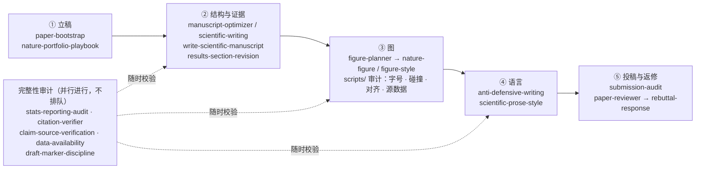

<div align="center">

# 🧬 Nature-Paper-Skills

**面向 `Nature` 系列期刊稿件的 agent skill 仓库**

从初稿搭建 · 结构修订 · 图文对齐 · 引用核验 · 投稿前预检 到 返修回复的全链路
`journal-first` · `claim-driven` · 证据边界优先

<br/>

[](LICENSE)
[](docs/venue-routing.md)
[](docs/workflow-map.md)
[](docs/skill-map.md)
[](docs/installation-codex.md)
[](docs/installation-claude.md)
[](CONTRIBUTING.md)
[](https://github.com/Boom5426/Nature-Paper-Skills/stargazers)

**简体中文** · [English](README.en.md) · [快速开始](#-快速开始) · [技能地图](#-仓库里有什么) · [默认工作流](#-默认工作流)

</div>

---

> [!NOTE]
> 这是一个**强约束**的仓库，不是"通用论文写作技巧集合"。默认立场是 journal-first、claim-driven、证据边界优先；未明确 venue 时按 `Nature` 系列期刊导向处理。

## ✨ 特性

- 🎯 **一图一主张**：`figure-planner` 先定每张图的论点，`nature-figure` 出图，`figure-style` 查正确性
- 🧱 **结构先于润色**：先用 reverse outline 稳住证据链，再做句子级 `scientific-prose-style`
- 🔬 **证据边界优先**：Abstract / Introduction 不允许比下游证据更强
- 📊 **统计与图注可审计**：`stats-reporting-audit` 守住独立实验单元 n、多重比较、图注统计
- 📎 **引用卫生**：`citation-verifier` 本地扫描 + 严重度分级，先查后投
- 🔧 **图形审计可执行**：`qa-contract.md` 的散文规则有了对应命令，字号、碰撞、面板对齐、源数据可追溯都能真跑一遍，而且工具会明确说「我查不了」而不是默认通过
- 🚪 **多入口**：`paper-workflow` 是兜底，不是唯一入口；任何一层都能直接叫
- 📦 **可直接复制**：每个 skill 自包含，脚本随目录分发，Codex 与 Claude Code 可并存

## 📦 快速开始

一条命令，不用克隆。脚本会自动识别你用的是 Codex 还是 Claude Code，装好推荐的 18 个 skill，并干净地覆盖旧版本。

```bash
curl -fsSL https://raw.githubusercontent.com/Boom5426/Nature-Paper-Skills/main/install.sh | bash
```

装完后彻底重启 agent 让它加载新装的 skills（退出并重新打开 Claude Code 或 Codex，不是 /clear），再把这句话发过去：

```text
用 paper-workflow 帮我判断这篇稿子下一步该用哪个 skill。
```

以后凡是泛泛的请求（`帮我优化论文`、`润色一下`、`投稿前检查`）都直接说就行，
paper-workflow 会先分类再报出要跑的整条链，不会只挑一个 skill 就开工。

```text
帮我优化这篇论文。
```

到这里就装完了，下面全是可选项。

<details>
<summary><b>安装选项</b></summary>

<br/>

```bash
# 不用自动识别，自己指定 agent（claude | codex | both）
curl -fsSL https://raw.githubusercontent.com/Boom5426/Nature-Paper-Skills/main/install.sh | bash -s -- --agent codex

# 额外装上图形技能（需要绘图后端，见下方 TIP）
curl -fsSL https://raw.githubusercontent.com/Boom5426/Nature-Paper-Skills/main/install.sh | bash -s -- --figure

# 只对当前项目生效，不写入 home 目录（Claude Code）
curl -fsSL https://raw.githubusercontent.com/Boom5426/Nature-Paper-Skills/main/install.sh | bash -s -- --agent claude --local

# 装全部 27 个 skill；或先预览，不写任何文件
curl -fsSL https://raw.githubusercontent.com/Boom5426/Nature-Paper-Skills/main/install.sh | bash -s -- --set all
curl -fsSL https://raw.githubusercontent.com/Boom5426/Nature-Paper-Skills/main/install.sh | bash -s -- --dry-run
```

完整参数见 `--help`。重复执行即原地升级。

</details>

<details>
<summary><b>想先看脚本内容，或者习惯从克隆装</b></summary>

<br/>

把网上的脚本直接 pipe 给 `bash` 值得警惕，这很合理。可以先读 [install.sh](install.sh)，或者克隆下来本地跑：

```bash
git clone https://github.com/Boom5426/Nature-Paper-Skills.git
cd Nature-Paper-Skills
./install.sh --agent claude --figure
```

这样运行时脚本直接用你本地的克隆作为来源，不会联网下载任何东西。如果想改成拉取某个已发布版本，加 `--ref <branch|tag|sha>`。

</details>

<details>
<summary><b>想完全手动装</b></summary>

<br/>

复制整个 skill 目录，不要只复制 `SKILL.md`，因为部分 skill 自带脚本。重装前先删掉旧目录，否则上游已删除的文件会残留，同一个目录里混着两个版本。

```bash
# 安装目标：Codex 用 ~/.codex/skills；Claude Code 用 ~/.claude/skills（仅当前仓库用 .claude/skills）
DEST=~/.codex/skills
mkdir -p "$DEST"
for s in skills/core/*/ skills/venue/nature-portfolio-playbook/; do
  name=$(basename "$s")
  rm -rf "$DEST/$name"
  cp -R "$s" "$DEST/$name"
done
```

分 agent 的细节见 [docs/installation-claude.md](docs/installation-claude.md) · [docs/installation-codex.md](docs/installation-codex.md)。

</details>

> [!TIP]
> **图形技能**（`nature-figure`、`figure-style`）默认不在推荐安装集内，因为它们需要绘图后端（Python matplotlib / seaborn 或 R ggplot2）。`nature-figure` 的可选 AI 示意图路线另需 `OPENROUTER_API_KEY`，Python / R 绘图主路线不需要。加 `--figure` 即可安装。

## 🔄 默认工作流


```mermaid
flowchart LR
    A["① 立稿<br/>paper-bootstrap<br/>nature-portfolio-playbook"]
    B["② 结构与证据<br/>manuscript-optimizer / scientific-writing<br/>write-scientific-manuscript<br/>results-section-revision"]
    C["③ 图<br/>figure-planner → nature-figure / figure-style<br/>scripts/ 审计：字号 · 碰撞 · 对齐 · 源数据"]
    D["④ 语言<br/>anti-defensive-writing<br/>scientific-prose-style"]
    E["⑤ 投稿与返修<br/>submission-audit<br/>paper-reviewer → rebuttal-response"]
    F["完整性审计（并行进行，不排队）<br/>stats-reporting-audit · citation-verifier<br/>claim-source-verification · data-availability<br/>draft-marker-discipline"]
    A --> B --> C --> D --> E
    F -.随时校验.-> B
    F -.随时校验.-> C
    F -.随时校验.-> D
```

三条真正有信息量的约束：**结构在语言之前**（②在④之前，改错层就白改）；**完整性审计是并行的**，不是流水线上的一站，任何时候发现问题都回到②或③；**④之内也有序**，`anti-defensive-writing` 先于 `scientific-prose-style`，因为删掉防御性支架会重写段落开头和句界，反过来做就是做两遍。

> 工作流图中的 `nature-figure` / `figure-style` 属可选 Figure Stack，需按上方 TIP 额外安装。
>
> 写**综述 / survey / perspective** 时不走这条链：先用 `review-article-architecture` 立权威 plan，再用 `draft-marker-discipline` 建标记体系，压缩润色前先跑一次漂移审计。完整路径见 [docs/workflow-map.md](docs/workflow-map.md)。

默认假设：

- 以期刊稿为主，不以会议稿为主
- 未明确 venue 时按 `Nature` 系列期刊导向处理
- 先修结构与证据链，再做语句级润色

## 🚪 入口：不止 paper-workflow 一个

`paper-workflow` 是**兜底入口**，用在你自己也不确定下一步该用哪个的时候。它做的事是分类并报出整条链，不是把所有请求都揽过去。任何一层都可以直接进。

| 你要做的事 | 直接这么说 | 进入 |
|---|---|---|
| 不确定下一步 | 「帮我优化论文」「投稿前检查」 | `paper-workflow` 分类后报链 |
| 建新稿骨架 | 「起一个新稿的目录」 | `paper-bootstrap` |
| 选期刊、定文章类型 | 「投 Nature Methods 还是 Nat Biotech」 | `nature-portfolio-playbook` |
| 结构和证据链不稳 | 「这篇稿子逻辑乱」 | `manuscript-optimizer` |
| 段落读不懂但结论没错 | 「这段话别扭」 | `write-scientific-manuscript` |
| 定每张图要证明什么 | 「这几张图该怎么排」 | `figure-planner` |
| 出图 | 「画一张对比图」「科研绘图」 | `nature-figure` |
| 查一张已画好的图 | 「这张图有没有问题」 | `figure-style` |
| Results 一图一段流水账 | 「Results 太散」 | `results-section-revision` |
| 统计报告完整性 | 「检查统计」「n 怎么算」 | `stats-reporting-audit` |
| 引用卫生 | 「查参考文献」 | `citation-verifier` |
| 引用是否支撑论断 | 「这句的引用对吗」 | `claim-source-verification` |
| 数据可用性声明 | 「写 data availability」 | `data-availability` |
| 写得太怂、免责太多 | 「太啰嗦」「让语气更肯定」 | `anti-defensive-writing` |
| 句子级润色 | 「润色一下这段」 | `scientific-prose-style` |
| 投稿前预检 | 「投稿前全面检查」 | `submission-audit` |
| 返修回复 | 「回复审稿人」 | `rebuttal-response` |
| 写综述 / perspective | 「写一篇综述」 | `review-article-architecture`（不走上面那条链） |

> 一条例外：**泛泛的**稿件请求先进 `paper-workflow`。因为论文有结构、段落逻辑、期刊风格、标点四层，改错层就白改，而单个技能只覆盖一层。点名了技能或具体活儿就直接去，不用绕。

## 🔬 图形链路（展开）

图形是本仓库唯一带可执行审计的一层，展开写清楚：

```
figure-planner          一图一主张、panel 角色、main vs supplement、图注与正文对齐
   │                    不画图
   ▼
nature-figure           路由协议
   ├ 步骤 1  读 manifest + 常驻的 contract.md / stance.md
   ├ 步骤 2  后端门（阻塞）：Python 还是 R，记住偏好
   ├ 步骤 3  只加载选中后端的 fragment
   ├ 步骤 4  出图：五点契约 → 默认立场 → backend fragment
   ├ 步骤 5  按需打开 17 份 references
   └ 步骤 6  交付前跑审计
   ▼
figure-style            正确性 checklist + kernel.py helper
   ▼
审计脚本                 渲染前  validate_figure.py my_figure.py
（skills/figure/         导出后  audit_pdf_text.py panel_a.pdf --min-pt 5   ← 逐 panel
  nature-figure/         拼板后  audit_figure_collisions.py fig02.pdf       ← 合成图
  scripts/）             多面板  audit_panel_alignment.py fig02.layout.json
                         数据侧  figure_source_data.py → <figure>.qa.json
                         数值侧  figure_safety.py
   ▼
qa-contract.md          投稿前清单
```

**退出码是统一契约**，四个审计工具共用。`validate_figure.py` 只会出 0/1/2，因为静态源码检查总能跑、总能给答案；另外三个还会用到 3 和 4：

| 码 | 含义 | 算通过吗 |
|---|---|---|
| 0 | PASS，查了，没问题 | 是 |
| 1 | FAIL，查了，有阻塞问题 | 否 |
| 2 | ERROR，用法或 IO 错误，什么都没查 | 否 |
| 3 | NOT RUN，依赖缺失，什么都没查 | 否 |
| 4 | NOT AUDITABLE，输入回答不了这个问题 | 否 |

2、3、4 表示这张图**没被检查**，不是干净。按 `returncode != 1` 分支的封装会交付一张没审过的图。一个不会说「我查不了」的审计工具，比没有审计更危险。

## 🧩 仓库里有什么

**核心技能** `skills/core/`

| Skill | 作用 |
|---|---|
| `paper-workflow` | 泛泛请求的唯一入口：按稿件粒度分类，给出必须整条跑完的 skill 链 |
| `paper-bootstrap` | 初始化论文项目、source of truth 与状态文件 |
| `scientific-writing` | 章节撰写与重写（全段落 prose）、引用格式与报告规范 |
| `write-scientific-manuscript` | 段落级清晰度与逻辑诊断：读不懂的那段到底哪里出了问题 |
| `manuscript-optimizer` | 结构、证据链、术语、图逻辑漂移修复 |
| `results-section-revision` | Results 小节级叙述结构修复 |
| `figure-planner` | 一图一主张、panel 角色、legend 同步、Nature 配色 |
| `citation-verifier` | 引用与 BibTeX 卫生 + 严重度分级 + LaTeX 工具链加固 |
| `claim-source-verification` | 对抗式核验：这条文献到底支不支持这句话 |
| `review-article-architecture` | 综述 / survey / perspective 架构：权威 plan、漂移审计、论点即宏 |
| `draft-marker-discipline` | 稿内标记体系、按解决途径分诊、真实字数、安全归档、断言式改稿 |
| `data-availability` | 数据可用性声明、仓库/accession、FAIR、中文对照 |
| `submission-audit` | 投稿前 / 返修前总预检 |
| `rebuttal-response` | 审稿意见回复与改稿联动 |
| `stats-reporting-audit` | 统计报告审计（n、重复性、多重比较、图注统计）|
| `anti-defensive-writing` | 去掉防御性写作：多余免责、放在高权重位置的限定、以限制开头的段落。审计技能定下的限定是承重的，只改形式不删 |
| `scientific-prose-style` | 句子级润色（em-dash 预算、hedging、句长节奏）|

**图形技能** `skills/figure/`

| Skill | 作用 |
|---|---|
| `nature-figure` | 提交级 Python / R 出图工作流 + 可选 OpenRouter AI 示意图（需绘图后端）|
| `figure-style` | 出版级图形正确性与可读性清单 + 可移植 matplotlib 辅助函数 |

**期刊定位技能** `skills/venue/`

| Skill | 作用 |
|---|---|
| `nature-portfolio-playbook` | 在 Nature / Nature Methods / Nature Biotechnology 间定位并做政策预检 |

**研究与审稿技能** `skills/research/` · `skills/review/`

| Skill | 作用 |
|---|---|
| `paper-analyzer` | 单篇论文的结构化深读 |
| `academic-researcher` | 文献综述与方法学支持 |
| `results-analysis` | 把实验输出转成可辩护的论文级结论 |
| `paper-reviewer` | 审稿人视角的方法 / 统计 / 复现性评估；把收到的审稿意见拆成逐条 ask，检查回复是否逐个对应 |

**可选技能** `skills/optional/`

| Skill | 作用 |
|---|---|
| `reference-audit-guide` | 联网核验引用是否真实存在：CrossRef / Semantic Scholar / arXiv / PubMed，附可运行脚本 |
| `conference-paper-writing` | 仅用于 conference-first 流程 |
| `academic-presentations` | 论文转 slides / talk |

<details>
<summary><b>装完没反应 / 常见问题</b></summary>

<br/>

**agent 好像没加载 skill。** 装完必须**完全重启** agent，退出进程再打开，`/clear` 不够，它不会重新扫描 skill 目录。

**它只用了一个 skill，没跑完整条链。** 直接说 `用 paper-workflow` 或者把请求说得更泛一点（`帮我优化这篇论文`）。`paper-workflow` 会先分类再报出要跑的链；如果它没报链就直接开工，说明匹配到了别的 skill，点名让它走 paper-workflow。

**它让我用某个 skill，但我这儿没有。** 默认只装 17 个。`nature-figure` 和 `figure-style` 要 `--figure`（需要 matplotlib/seaborn 或 ggplot2），其余的用 `--set all`。

**装到哪儿了。** Claude Code 是 `~/.claude/skills/`，Codex 是 `~/.codex/skills/`，`--local` 是当前项目的 `./.claude/skills/`。`bash install.sh --list` 可以先看要装什么，`--dry-run` 可以看会发生什么但不写盘。

**同时装了 Codex 和 Claude Code。** `--agent both`，两边互不干扰。

**想换个版本或回滚。** `--ref <branch|tag|sha>` 从指定 ref 安装。重复运行是幂等的，会干净覆盖旧版本。

</details>

## 🧭 设计原则

- claim-driven，而不是 panel-driven
- 一张主图尽量只承载一个主结论
- 图注是结果叙述的第二层，不是只解释坐标轴
- 主文只保留支撑本段 claim 的关键数字
- 对已有章节重写前，先做 reverse outline
- 不允许前半部分（Abstract / Introduction）比下游证据更强
- venue 与 article type 要前置决策，不要末期再救火
- 文献存在且元数据正确，不等于它支持那句话
- 权威文档高于好想法：冲突要提出，不能靠改稿子解决

详见 [workflow-map](docs/workflow-map.md) · [skill-map](docs/skill-map.md) · [venue-routing](docs/venue-routing.md) · [design-principles](docs/design-principles.md)。

## 📐 仓库结构

```text
Nature-Paper-Skills/
├── docs/            # 工作流图、安装说明、设计参考
├── examples/        # 期望输出与 handoff 样例
├── skills/
│   ├── core/        # 默认期刊工作流
│   ├── figure/      # 图形生产与图形正确性
│   ├── venue/       # 期刊定位与政策
│   ├── research/    # 文献、分析、证据生成
│   ├── review/      # 审稿人视角评估
│   └── optional/    # 有用但非默认的扩展
│                    #   figure/nature-figure/scripts/ 内含 6 个零依赖审计工具
├── tests/           # 243 个测试，`python3 -m unittest discover -s tests`
├── install.sh       # Codex / Claude Code 一条命令安装脚本
├── ATTRIBUTION.md   # 逐项来源，含 Apache-2.0 §4(b) 修改文件清单（有测试盯着）
├── CONTRIBUTING.md
├── LICENSE          # 仓库自有内容 MIT
├── LICENSE-APACHE   # vendored skill 的 Apache-2.0 全文
├── NOTICE
├── README.md
└── README.en.md
```

脚本随 skill 目录分发，保证 skill 可独立复制和复用。`install.sh` 会把 `LICENSE-APACHE` 和 `NOTICE` 一并装进含 Apache-2.0 材料的 8 个 skill 目录，所以 `curl | bash` 装完手上是有许可证的。

## 🎯 适用范围

| 适用 | 不追求 |
|---|---|
| `Nature` 系列生命科学 / 计算生物 / 方法学论文 | 覆盖所有期刊写作风格 |
| methods / frameworks / benchmarks / resources / translational | 会议模板大全 |
| 写作、修稿、投稿前预检与返修回复 | 全量研究平台编排 |
|  | 替代官方 author guidelines |

## 🤝 贡献

贡献规范、命名约定和 PR 预期见 [CONTRIBUTING.md](CONTRIBUTING.md)。来源归因见 [ATTRIBUTION.md](ATTRIBUTION.md)。

## 🙏 致谢

本仓库部分代码和灵感来源于 [OpenLAIR/dr-claw](https://github.com/OpenLAIR/dr-claw)、[罗小罗团队 Yuan1z0825/nature-skills](https://github.com/Yuan1z0825/nature-skills) 与 Claude Science skill pack。

图形层的编码规则参考了 [ChenLiu-1996/figures4papers](https://github.com/ChenLiu-1996/figures4papers)（Chen Liu，Yale）中真实论文出图脚本的设计观察。该仓库未公开 LICENSE，本仓库不复制也不分发其任何代码或文字，配方均为独立重写；完整声明见 [THIRD_PARTY_NOTICES.md](skills/figure/nature-figure/THIRD_PARTY_NOTICES.md)。

感谢所有为本项目贡献代码、文档和测试的开发者社区成员。逐项来源与许可见 [ATTRIBUTION.md](ATTRIBUTION.md)。

## 📄 许可

仓库自有内容为 [MIT](LICENSE)。部分 vendored skill（`nature-figure`、`figure-style`、`scientific-prose-style`、`stats-reporting-audit` 及若干合并片段）为 Apache-2.0，许可全文见 [LICENSE-APACHE](LICENSE-APACHE)，覆盖范围见 [NOTICE](NOTICE)。
