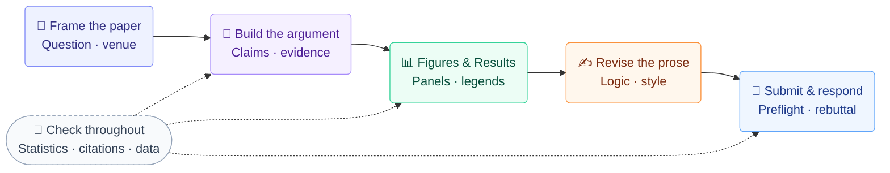

<div align="center">

# 🧬 Nature-Paper-Skills

**Build the argument before polishing the prose.**

27 modular skills for Codex and Claude Code, connecting scientific claims, evidence, figures, writing, citations and reviewer responses.  
Built for life-science, computational-biology and methods manuscripts.

🧠 **Structure** · 📊 **Figures** · ✍️ **Writing** · 📚 **Citations** · 📨 **Rebuttals**

[](docs/skill-map.md)
[](https://github.com/Boom5426/Nature-Paper-Skills/actions/workflows/ci.yml)
[](#license)
[](https://github.com/Boom5426/Nature-Paper-Skills/stargazers)

🌐 **README:** **English** · [简体中文](README.zh-CN.md) &nbsp;&nbsp;|&nbsp;&nbsp; **Website:** [English](https://boom5426.github.io/Nature-Paper-Skills/) · [简体中文](https://boom5426.github.io/Nature-Paper-Skills/zh/)

[🗺️ Workflow](#workflow-at-a-glance) · [🚀 Quick start](#quick-start) · [🧩 Choose a task](#choose-a-task) · [📚 All skills](docs/skill-map.md)

</div>

---

<a name="what-makes-the-workflow-useful"></a>

## ✨ Why this workflow

- **Argument before style.** Define the scientific question, contribution and claim–evidence chain before rewriting sentences.
- **Evidence-bound edits.** Preserve measured values, independent units, uncertainty, negative results and necessary scope conditions.
- **Figure-led Results.** Give each main figure a claim, align its panels and legends with Results, and use optional figure-production and QA tools when needed.
- **Section-specific writing.** Keep the Abstract, Introduction, Results, Discussion and Methods focused on their distinct roles, with consistent scientific claims.
- **Citations and rebuttals.** Check whether a cited source supports a claim; connect each reviewer response to completed evidence and actual manuscript changes.
- **Task-sized revisions.** Improve a whole manuscript, one section or one paragraph without reopening settled material.

Section patterns are informed by [28 computational-method Articles](skills/core/paper-workflow/references/section-evidence.md); they are descriptive guidance, **not journal formatting rules**.

<a name="workflow-at-a-glance"></a>

## 🗺️ Workflow at a glance

**One connected workflow, from the research question to the reviewer response.**


```mermaid
flowchart LR
    A("🎯 Frame the paper<br/>Question · venue")
    B("🧠 Build the argument<br/>Claims · evidence")
    C("📊 Figures & Results<br/>Panels · legends")
    D("✍️ Revise the prose<br/>Logic · style")
    E("📨 Submit & respond<br/>Preflight · rebuttal")
    I(["🔎 Check throughout<br/>Statistics · citations · data"])
    A --> B --> C --> D --> E
    I -.-> B
    I -.-> C
    I -.-> E
    classDef frame fill:#eef2ff,stroke:#818cf8,color:#312e81;
    classDef argument fill:#f5f0ff,stroke:#a78bfa,color:#4c1d95;
    classDef figures fill:#ecfdf5,stroke:#34d399,color:#064e3b;
    classDef prose fill:#fff7ed,stroke:#fb923c,color:#7c2d12;
    classDef response fill:#eff6ff,stroke:#60a5fa,color:#1e3a8a;
    classDef integrity fill:#f8fafc,stroke:#94a3b8,color:#334155,stroke-dasharray:4 3;
    class A frame;
    class B argument;
    class C figures;
    class D prose;
    class E response;
    class I integrity;
```

Structure and evidence come before sentence polish. Statistics, citation support and data availability are checked at the relevant stages. Enter at the stage your task needs; a paragraph edit does not require the entire chain. Reviews, surveys and Perspectives have their own architecture route.

The diagram includes figure production, available with `--figure`; the default installation already covers figure planning, manuscript revision and reviewer responses.

[🗺️ Full workflow](docs/workflow-map.md) · [📐 Section contracts](skills/core/paper-workflow/references/section-contracts.md) · [📚 All skills](docs/skill-map.md) · [✍️ Writing principles](docs/design-principles.md) · [📊 Figure workflow](docs/figure-workflow.md)

<a name="see-what-changes"></a>

## 🪄 See what changes

**A synthetic teaching example:** a draft claims improved survival although the supplied survival interval does not establish a benefit. The reference revision corrects the claim rather than merely smoothing the prose.

| Draft — unsupported conclusion | Reference revision — evidence-aligned conclusion |
|---|---|
| “These results demonstrate that the treatment improves both marker expression and survival.” | “The treatment therefore increased marker expression without a demonstrated survival benefit.” |

**Evidence retained in the full revision:** 12 independent cultures; marker expression **+18%** (95% CI **10–26%**; Fig. 1a); survival **+1 percentage point** (95% CI **−3 to 5**; Fig. 1b). The survival interval does not establish either a benefit or no effect.

The reference edit also removes defensive narration while keeping every measurement and figure reference. It is **an illustrative expected output, not a recorded agent run or a real study**.

[See the interactive example](https://boom5426.github.io/Nature-Paper-Skills/examples/first-revision/) · [Read the full input, evidence and reference revision](examples/first-run/README.md) · [More editing examples](skills/core/anti-defensive-writing/references/worked-examples.md)

<a name="quick-start"></a>

## 🚀 Quick start

<a name="1-install"></a>

### 1. Choose a skill profile and install

| Profile | Best for | Installer selection |
|---|---|---|
| **Full research workflow · 27 skills** | Manuscript work, figures, literature and analysis extensions | `--set all` |
| **Writing & review · recommended 19-skill stack** | Structure, prose, references, submission and rebuttal | `--set recommended` (installer default) |
| **Writing & review + figures · 21 skills** | The 19-skill stack plus figure production and checks | `--set recommended --figure` |

**Copy this instruction into Codex or Claude Code for the full 27-skill profile:**

```text
Read and follow https://github.com/Boom5426/Nature-Paper-Skills/blob/main/INSTALL.md to install all 27 Nature Paper Skills for this environment, using the all profile, and verify the result.
If the page cannot be read, use an available GitHub tool or git clone to retrieve the main branch and read INSTALL.md from the repository root; do not substitute search snippets for the file.
```

For the **19- or 21-skill profile**, choose a ready-to-copy instruction from the [website's installation builder](https://boom5426.github.io/Nature-Paper-Skills/install/), or explicitly request the chosen profile when asking the agent to follow `INSTALL.md`. The installer otherwise defaults to 19 skills.

Local installation needs **Bash and Python 3.9+**; remote source retrieval also needs `curl` and `tar`. The agent should report the actual installation location, profile, integrity check and whether live client discovery was tested. File integrity does not establish that a new agent session can invoke the skill.

<a name="install-codex-bash"></a>

<details>
<summary><b>Codex · Linux/macOS command and Windows setup</b></summary>

```bash
curl -fsSL https://raw.githubusercontent.com/Boom5426/Nature-Paper-Skills/main/install.sh | bash -s -- --agent codex --set all
```

Use the flags in the profile table for smaller sets. Install into the agent's actual environment, then refresh/reopen Codex and invoke `$paper-workflow` in CLI/IDE. Native Windows and WSL installations need different target paths; follow the [Codex setup guide](docs/installation-codex.md#windows-desktop-app). The repository root is a collection, not a single skill.

</details>

<a name="install-claude-code"></a>

<details>
<summary><b>Claude Code · Linux/macOS command</b></summary>

```bash
curl -fsSL https://raw.githubusercontent.com/Boom5426/Nature-Paper-Skills/main/install.sh | bash -s -- --agent claude --set all
```

Use the flags in the profile table for smaller sets. Refresh/reopen Claude Code and invoke `/paper-workflow`. See the [Claude Code setup guide](docs/installation-claude.md).

</details>

<a name="install-chatgpt-work-web"></a>

<details>
<summary><b>ChatGPT Work on the web · registration not yet verified</b></summary>

Web installation is **not confirmed**. Downloading skills or generating a directory in a web task does not register them for later chats. Persistent use requires an available account/workspace registration flow; report it as unavailable if the flow is absent. See [web distribution and verification](docs/installation-chatgpt-work.md).

</details>

<a name="2-complete-your-first-revision"></a>

### 2. Complete your first revision

Once `paper-workflow` is discoverable in the agent, place your manuscript excerpt and supporting evidence in its working folder, then ask:

```text
Use paper-workflow. Revise only the Results paragraph in draft.md using evidence.md.
Preserve measured values, confidence intervals and figure references.
Save a revised copy and explain the material changes.
```

Try the [self-contained first-run example](examples/first-run/README.md) before working with a private manuscript. You can then ask in plain language to improve a manuscript, review a section or check a citation; you do not need to memorize skill names.

<a name="choose-a-task"></a>

## 🧩 Choose a task

| Your task | Provide | Expected result | Entry |
|---|---|---|---|
| 🧬 Improve a whole manuscript | Current draft, relevant results/figures, target venue if decided | Revised draft, key changes, unresolved evidence gaps | `paper-workflow` |
| 📐 Write or revise one section | The section, current Results and figures, target journal | Revised section held to its contract; claims resting on unsettled results named | `paper-workflow` |
| ✍️ Fix a paragraph | Passage, surrounding context, requested scope | Replacement passage with a brief explanation where useful | `write-scientific-manuscript` |
| 🪄 Remove audit/defensive writing | Main text, SI, legend or availability statement | Direct scientific prose retaining numbers and necessary conditions | `anti-defensive-writing` |
| 📊 Plan or make figures | Scientific question, result table or existing figure | Panel plan; rendered files when data and tools are available | `figure-planner`; add `--figure` for production |
| 🔎 Check before submission | Final draft, SI, bibliography and venue | Prioritized findings with locations; unchecked categories identified | `submission-audit` |
| 📨 Reply to reviewers | Original comments, manuscript, completed new evidence | Numbered response draft and matching manuscript changes | `paper-workflow` |

A request to **review or suggest** produces findings. A request to **revise** produces edits within the requested scope. Missing evidence is surfaced; it is never written into existence.

For complete prompts and task setups, see [task examples](docs/task-recipes.md). The optional `--set all` selection includes a [recomputable statistics walkthrough](skills/research/results-analysis/USAGE.md); its example helper needs SciPy.

<a name="installation-options"></a>

## ⚙️ Installation, updates and compatibility

The local installer supports `--dry-run`, `--doctor`, `--on-conflict`, `--restore` and `--ref <full-commit-sha>`. It records provenance and hashes, and backs up files when replacing an existing installation. Existing modified or linked skills require the appropriate conflict policy; do not overwrite them blindly.

[Installation management, update and restore](docs/installation-management.md) · [Codex setup (including Windows)](docs/installation-codex.md) · [Claude Code setup](docs/installation-claude.md) · [Supported environments and file formats](docs/compatibility.md)

The skills provide instructions and optional helper scripts, not the external editors, runtimes, source access or experiments required for every task.

<a name="scope-and-limits"></a>

## 🧭 Scope and limits

This is a focused journal-writing workflow for life sciences, computational biology, methods, benchmarks and resources. Explicit venue and project instructions take precedence over its Nature-style defaults. It is independent of Nature Portfolio and does not predict acceptance.

The typical section shapes come from 28 open-access computational-method papers in three Nature Portfolio journals ([evidence and limits](skills/core/paper-workflow/references/section-evidence.md)). They are checks on a draft, not format rules; the target journal's current guide sets the format.

Skills provide instructions and some helper scripts. They do not themselves supply a Word editor, PDF renderer, LaTeX installation, browsing access or experimental evidence. [Compatibility](docs/compatibility.md) separates readable inputs from editable/exportable outputs.

Repository tests cover scripts, installation and consistency. [Behavior cases](evals/README.md) check task scope, evidence preservation and honest reporting of missing capabilities; their limitations and recorded runs are documented separately.

<a name="contributing"></a>

## 🤝 Contributing

See [CONTRIBUTING.md](CONTRIBUTING.md). Changes to user-facing behavior should include a task case or an example, and both READMEs should stay aligned. Component provenance is in [ATTRIBUTION.md](ATTRIBUTION.md).

<a name="acknowledgements"></a>

## 💙 Acknowledgements

Parts of this repository were inspired by [OpenLAIR/dr-claw](https://github.com/OpenLAIR/dr-claw), [Yuan1z0825/nature-skills](https://github.com/Yuan1z0825/nature-skills), and the Claude Science skill pack.

The figure layer also draws on design observations from [ChenLiu-1996/figures4papers](https://github.com/ChenLiu-1996/figures4papers). None of that repository's code or prose is distributed here; see [THIRD_PARTY_NOTICES](skills/figure/nature-figure/THIRD_PARTY_NOTICES.md).

<a name="license"></a>

## ⚖️ License

Original content is [MIT](LICENSE). Components carrying Apache-2.0 material retain [LICENSE-APACHE](LICENSE-APACHE) and [NOTICE](NOTICE), including in installer-managed copies. See [ATTRIBUTION](ATTRIBUTION.md) for coverage.

## ⭐ Star History

[](https://star-history.com/#Boom5426/Nature-Paper-Skills&Date)
