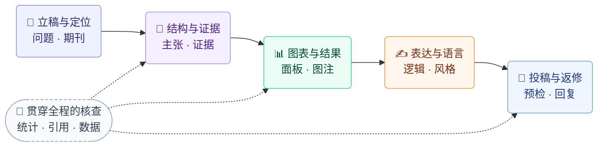

<div align="center">

# 🧬 Nature-Paper-Skills

**从科研初稿到投稿与返修，把研究成果写成论证清楚、证据扎实的期刊论文。**

27 个 skill，将结构修订、科学写作、论文图表、引用核验与审稿回复串成一套工作流。面向 Codex 和 Claude Code，聚焦 Nature 系列生命科学、计算生物学与方法学稿件。

🧠 **论文结构** · 📊 **科研图表** · ✍️ **科学写作** · 📚 **引用核验** · 📨 **审稿回复**

🌐 [English](README.md) · **简体中文**

[🌐 项目主页](https://boom5426.github.io/Nature-Paper-Skills/zh/) · [🗺️ 工作流总览](#工作流总览) · [🚀 快速开始](#快速开始) · [🧩 按任务选择](#按任务选择) · [🪄 Examples](#修改效果示例) · [🧩 27 Skills](docs/skill-map.md)

</div>

---

<a name="核心特点"></a>

## ✨ 核心特点

- 🎯 **论证先于语言。** 先明确科学问题、贡献和论断与证据的对应关系，再优化句子。
- 🔒 **修订受证据约束。** 保留测量值、独立实验单位、不确定性、阴性结果和必要的适用条件。
- 📊 **以图表组织 Results。** 每张主图有清晰结论，面板、图注与结果叙述一致；按需使用图形制作与质量检查工具。
- 📐 **各章节各司其职。** 摘要、引言、结果、讨论和方法完成不同的论证任务，同时保持科学结论一致。
- 🌍 **写给目标 venue 的读者。** 该写什么、不该写什么，由目标 venue 的编辑、审稿人和大同行决定。前两句就让读者看到他们自己的问题，用读者依赖的标准衡量结果，保留读者用得上的数字。技术细节放在结果正文和方法里。审稿人会专门找的句子（比如 ML 论文的防泄漏声明）会保留，不会被当作防御腔删掉。
- 📚 **引用核验与审稿回复。** 区分文献是否存在和是否支持论断，让每条审稿回复对应已完成的证据和实际改稿。
- 🧩 **按需局部修改。** 可以处理整篇、一个章节或一段文字，不必重新打开已经确定的内容。

各章节的典型组织方式参考了 [28 篇计算方法学 Article](skills/core/paper-workflow/references/section-evidence.md)；这是描述性参考，**不是期刊的格式规定**。

<a name="工作流总览"></a>

## 🗺️ 工作流总览

**从科学问题到审稿回复，把论文各层接成一套工作流。**



结构与证据先于句子润色，统计、引用与论断、数据可用性核查贯穿相关阶段。按任务从需要的位置进入；修改一个段落时，只处理相关层次。综述、survey 和 Perspective 有独立的架构路径。

图中的图形制作需加装 `--figure`；默认安装已包含图形规划、稿件修订与审稿回复。

[🗺️ 完整工作流](docs/workflow-map.md) · [📐 各部分写作合同](skills/core/paper-workflow/references/section-contracts.md) · [📚 全部技能](docs/skill-map.md) · [✍️ 写作原则](docs/design-principles.md) · [📊 图形流程](docs/figure-workflow.md)

<a name="修改效果示例"></a>

## 🪄 一次有证据约束的修订

**虚构教学案例：** 原稿声称处理提高了细胞存活，但已有存活结果的置信区间不足以支持该结论。参考修订纠正了科学解释，而不只是润色语言。

| 修改前：缺少证据支持的结论 | 修改后：符合证据的参考结论 |
|---|---|
| “These results demonstrate that the treatment improves both marker expression and survival.” | “The treatment therefore increased marker expression without a demonstrated survival benefit.” |

**完整修订保留的证据：** 12 个独立培养样本；标志物表达增加 **18%**（95% CI **10–26%**；Fig. 1a）；存活变化 **+1 个百分点**（95% CI **−3 至 5**；Fig. 1b）。这个区间既不能证明存活获益，也不能证明完全没有效应。

参考修订还删除了防御性描述，保留所有测量值和图号。它是**示意性参考答案，不是实际运行记录，也不代表真实研究结果**。

[查看网页交互案例](https://boom5426.github.io/Nature-Paper-Skills/zh/examples/first-revision/) · [查看完整原稿、证据与参考修订](examples/first-run/README.md) · [更多文字修改案例](skills/core/anti-defensive-writing/references/worked-examples.md)

<a name="快速开始"></a>

## 🚀 快速开始

<a name="1-安装"></a>

### 1. 选择技能组合并安装

| 技能组合 | 适用任务 | 安装参数 |
|---|---|---|
| **完整科研工作流 · 27 个 skill** | 论文、科研图表、文献与分析扩展 | `--set all` |
| **写作与审稿 · 推荐的 19 个 skill** | 结构、语言、引用、投稿检查和审稿回复 | `--set recommended`（安装器默认） |
| **写作审稿 + 图表 · 21 个** | 19 个基础技能，另加图形制作与检查 | `--set recommended --figure` |

**在 Codex 或 Claude Code 中复制这条指令，即可请求安装完整的 27 个技能：**

```text
读取并执行 https://github.com/Boom5426/Nature-Paper-Skills/blob/main/INSTALL.md，为当前环境安装 Nature Paper Skills 全部 27 个技能（all 完整集），并验证结果。
若页面读取失败，请使用可用的 GitHub 工具或 git clone 获取 main 分支源码，再读取根目录 INSTALL.md；不要用搜索摘要代替原文。
```

如果需要 **19 或 21 个技能**，可以在[网站安装向导](https://boom5426.github.io/Nature-Paper-Skills/zh/install/)选择并复制相应指令，或明确要求代理按照 `INSTALL.md` 安装对应组合。未指定组合时，安装器默认安装 19 个。

本地安装需要 **Bash 和 Python 3.9+**；远程获取源码还需要 `curl` 和 `tar`。代理应报告实际安装目录、选择的组合、完整性检查及是否验证过新会话加载。文件校验通过不等于客户端已成功识别技能。

<a name="install-codex-bash"></a>

<details>
<summary><b>Codex · Linux/macOS 命令与 Windows 说明</b></summary>

```bash
curl -fsSL https://raw.githubusercontent.com/Boom5426/Nature-Paper-Skills/main/install.sh | bash -s -- --agent codex --set all
```

要安装更小的组合，替换为表格中的参数。请安装到实际 Agent 使用的环境，再刷新或重启 Codex；CLI/IDE 中可以调用 `$paper-workflow`。Windows 原生环境和 WSL 的目标目录不同，详见 [Codex 安装指南](docs/installation-codex.md#windows-desktop-app)。仓库根目录是技能集合，不能作为单个 Skill 安装。

</details>

<a name="install-claude-code"></a>

<details>
<summary><b>Claude Code · Linux/macOS 命令</b></summary>

```bash
curl -fsSL https://raw.githubusercontent.com/Boom5426/Nature-Paper-Skills/main/install.sh | bash -s -- --agent claude --set all
```

安装其他组合时使用表格中的参数。刷新或重新打开 Claude Code 后调用 `/paper-workflow`。见 [Claude Code 安装指南](docs/installation-claude.md)。

</details>

<a name="install-chatgpt-work-web"></a>

<details>
<summary><b>ChatGPT Work 网页版 · 持久注册尚未验证</b></summary>

**网页版自动安装尚未确认。** 在网页任务中下载技能或生成目录，不等于已经注册为新会话可用的 Skill。持久使用需要账号或工作区提供受支持的注册能力；若不可用，代理应明确说明。参见[网页版分发与验证](docs/installation-chatgpt-work.md)。

</details>

<a name="2-完成第一次修订"></a>

### 2. 完成第一次修订

确认代理能够识别 `paper-workflow` 后，将稿件片段与支持它的证据放入工作目录，再输入：

```text
使用 paper-workflow，依据 evidence.md 中的证据只修改 draft.md 的 Results 段落。
保留测量值、置信区间和图号，保存修订副本并说明关键改动。
```

建议先运行[不需要私人稿件的完整入门案例](examples/first-run/README.md)，再处理自己的论文。之后可以直接说“优化论文”“检查讨论”或“核对引用”，无需记住所有 Skill 名称。

<a name="按任务选择"></a>

## 🧩 按任务选择

| 想完成什么 | 提供什么 | 得到什么 | 入口 |
|---|---|---|---|
| 🧬 优化整篇论文 | 当前稿件、相关结果/图表、已确定的期刊 | 修订稿、关键修改、待补证据 | `paper-workflow` |
| 📐 撰写或修改某一部分 | 该部分原文、当前 Results 与图、目标期刊 | 按该部分合同修改的成品；依赖未定稿结果的论断会被指出 | `paper-workflow` |
| ✍️ 修改一个段落 | 原文、上下文、修改范围 | 修改后的段落和必要说明 | `write-scientific-manuscript` |
| 🪄 去掉审计式／防御式表达 | 正文、SI、图注或数据声明 | 更直接的科学表达，保留数字与必要条件 | `anti-defensive-writing` |
| 📊 规划或制作图表 | 科学问题、结果表或现有图 | 面板方案；有数据和工具时输出图文件 | `figure-planner`；出图另加 `--figure` |
| 🔎 投稿前检查 | 最终稿、SI、参考文献和目标期刊 | 有定位、按重要性排序的问题；注明未检查项 | `submission-audit` |
| 📨 回复审稿意见 | 原始意见、稿件、已完成的新证据 | 保留编号的回复草稿及对应稿件修改 | `paper-workflow` |

要求“检查／给建议”时先交付诊断；要求“修改”时在授权范围内改稿。缺失的证据会指出，不会补写成已完成的实验。

完整提示词与任务准备方式见[常用任务示例](docs/task-recipes.md)。选择 `--set all` 还包含[可复算的统计示例](skills/research/results-analysis/USAGE.md)，其示例 helper 需要 SciPy。

<a name="安装选项"></a>

## ⚙️ 安装维护与兼容性

本地安装器支持 `--dry-run`、`--doctor`、`--on-conflict`、`--restore` 和 `--ref <完整提交SHA>`。安装器记录版本来源与文件哈希，并在替换已有安装时备份；对于用户改动或软链接，请使用合适的冲突处理策略，不要直接覆盖。

[安装维护、更新与恢复](docs/installation-management.md) · [Codex 安装（含 Windows）](docs/installation-codex.md) · [Claude Code 安装](docs/installation-claude.md) · [支持的环境与文件格式](docs/compatibility.md)

Skills 提供流程说明和可选辅助脚本，不自带每项任务需要的编辑器、运行环境、来源访问权限或实验数据。

<a name="适用范围与边界"></a>

## 🧭 适用范围与边界

面向生命科学、计算生物学、方法、基准和资源类期刊论文。用户明确的期刊要求及项目决定优先于默认 Nature 风格。本项目独立于 Nature Portfolio，不预测录用结果。

各部分的典型篇幅来自三本 Nature Portfolio 期刊的 28 篇开放获取计算方法论文（[证据与局限](skills/core/paper-workflow/references/section-evidence.md)）。它们用于检查稿件，不是格式规定；格式以目标期刊当前的作者指南为准。

技能提供操作规则与部分辅助脚本，不自带 Word 编辑器、PDF 渲染器、LaTeX 环境、联网访问权限或实验数据。[兼容说明](docs/compatibility.md)分别列出可读取、可编辑与可导出的范围。

仓库测试覆盖脚本、安装与文件一致性。[行为案例](evals/README.md)用于检查修改范围、证据保留及缺少能力时的诚实报告；实际运行记录与适用边界单独列出。

<a name="参与贡献"></a>

## 🤝 参与贡献

见 [CONTRIBUTING.md](CONTRIBUTING.md)。影响用户行为的修改应附任务案例或示例，中英文首页同步维护。组件来源见 [ATTRIBUTION.md](ATTRIBUTION.md)。

<a name="致谢"></a>

## 💙 致谢

部分内容受到 [OpenLAIR/dr-claw](https://github.com/OpenLAIR/dr-claw)、[Yuan1z0825/nature-skills](https://github.com/Yuan1z0825/nature-skills) 和 Claude Science skill pack 的启发。

图形层还参考了 [ChenLiu-1996/figures4papers](https://github.com/ChenLiu-1996/figures4papers) 的设计经验。本仓库不分发该项目的代码或文字；详见 [THIRD_PARTY_NOTICES](skills/figure/nature-figure/THIRD_PARTY_NOTICES.md)。

<a name="许可"></a>

## ⚖️ 许可

原创内容使用 [MIT](LICENSE)。含 Apache-2.0 材料的组件保留 [LICENSE-APACHE](LICENSE-APACHE) 与 [NOTICE](NOTICE)，安装器分发时也会携带。覆盖范围见 [ATTRIBUTION](ATTRIBUTION.md)。

## ⭐ Star History

[](https://star-history.com/#Boom5426/Nature-Paper-Skills&Date)
